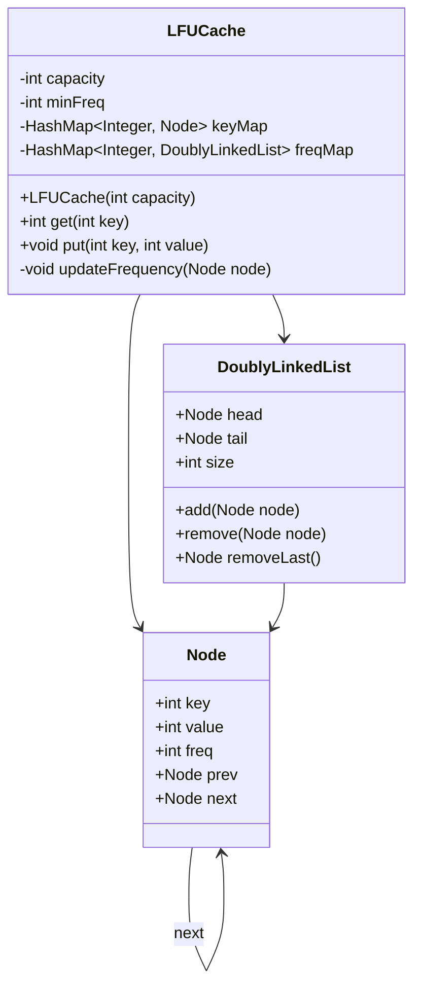
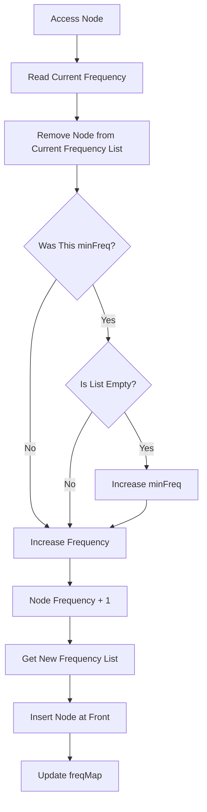

# 02 — LFU Cache

> **System & Software Design Quest — Level 2**

A production-oriented implementation of a **Least Frequently Used (LFU) Cache** using a combination of **HashMaps and Doubly Linked Lists** to achieve **O(1) average time complexity** for both `get()` and `put()` operations.

---

## 📌 Problem Statement

Design and implement a data structure that follows the constraints of a **Least Frequently Used (LFU) Cache**.

The cache must support:

```java
LFUCache(int capacity)
int get(int key)
void put(int key, int value)
```

The cache evicts an entry according to the following rules:

1. Remove the key with the **lowest access frequency**.
2. If multiple keys have the same frequency, remove the **least recently used (LRU)** key among them.

Both `get()` and `put()` must execute in:

```text
O(1) average time
```

---

# 🎯 Requirements

## Functional Requirements

### `LFUCache(capacity)`

Initialize the cache with a positive capacity.

### `get(key)`

- Return the value if the key exists.
- Return `-1` otherwise.
- Increment the key's frequency.
- Update its recency within the new frequency group.

### `put(key, value)`

- Insert a new key-value pair.
- Update an existing key's value.
- Increment frequency when an existing key is updated.
- If the cache is full, evict the LFU key.
- If multiple keys have the same frequency, evict the LRU key.

---

# 🧠 Core Design Challenge

An LFU cache is more complicated than an LRU cache.

An LRU cache only needs to maintain:

```text
Recency
```

An LFU cache must maintain:

```text
Frequency
        +
Recency within each frequency
```

For example:

```text
Frequency 1
┌─────────────────────────┐
│ 3 → 5 → 7               │
│ MRU         LRU         │
└─────────────────────────┘

Frequency 2
┌─────────────────────────┐
│ 8 → 4                   │
│ MRU    LRU              │
└─────────────────────────┘

Frequency 3
┌─────────────────────────┐
│ 9                       │
└─────────────────────────┘
```

If the cache becomes full, we first find the smallest frequency:

```text
minFreq = 1
```

Then remove the LRU entry from that frequency list.

---

# 🏗️ Architecture

The implementation uses **three cooperating components**.

```text
                    LFUCache
                       │
          ┌────────────┼────────────┐
          │            │            │
          ▼            ▼            ▼
       keyMap       freqMap      minFreq
          │            │
          │            │
      key → Node   freq → DLL
                       │
                       ▼
                Doubly Linked List
                       │
                       ▼
                    Node
```

---

# 🔹 1. Key Map

```java
HashMap<Integer, Node> keyMap;
```

Purpose:

```text
key → Node
```

This allows direct access to a cache entry.

Example:

```text
keyMap

1 ─────► Node(key=1, value=100, freq=2)

2 ─────► Node(key=2, value=200, freq=1)

3 ─────► Node(key=3, value=300, freq=3)
```

### Complexity

```text
get(key) → O(1) average
```

---

# 🔹 2. Frequency Map

```java
HashMap<Integer, DoublyLinkedList> freqMap;
```

This maps each frequency to a doubly linked list.

```text
Frequency
    │
    ▼
Doubly Linked List
```

Example:

```text
freqMap

1 → [4 ⇄ 2 ⇄ 7]

2 → [3 ⇄ 5]

3 → [9]
```

Within each frequency list:

```text
Head
 ↓
Most Recently Used
 ↓
...
 ↓
Least Recently Used
 ↓
Tail
```

Therefore, when a frequency tie occurs, the LRU entry can be removed in O(1).

---

# 🔹 3. Minimum Frequency

```java
private int minFreq;
```

`minFreq` stores the smallest frequency currently present in the cache.

Example:

```text
freqMap:

1 → [A, B]
2 → [C]
4 → [D]

minFreq = 1
```

When eviction is required:

```java
freqMap.get(minFreq)
```

immediately identifies the frequency group from which the victim must be removed.

---

# 🧩 Node Design

Each cache entry is represented by:

```java
class Node {
    int key;
    int value;
    int freq;
    Node prev;
    Node next;
}
```

Each node stores:

| Field | Purpose |
|---|---|
| `key` | Cache key |
| `value` | Cached value |
| `freq` | Number of uses |
| `prev` | Previous node |
| `next` | Next node |

The `key` is stored inside the node because it is required when removing an evicted node from `keyMap`.

---

# 🔗 Doubly Linked List

Each frequency owns a separate doubly linked list.

```text
HEAD
 ↓
[MRU]
 ↓
[Node]
 ↓
[Node]
 ↓
[LRU]
 ↓
TAIL
```

Dummy nodes are used:

```text
HEAD ⇄ Node ⇄ Node ⇄ TAIL
```

This eliminates special cases when inserting or removing nodes.

---

# 🔄 Frequency Update

Whenever a key is accessed:

```text
get(key)
```

or an existing key is updated:

```text
put(key, value)
```

its frequency increases.

Suppose:

```text
Node A

frequency = 2
```

Before:

```text
freq 2:

HEAD → A → B → TAIL
```

After accessing A:

```text
frequency = 3
```

A must be moved from the frequency-2 list to the frequency-3 list.

```text
freq 2:

HEAD → B → TAIL


freq 3:

HEAD → A → TAIL
```

---

# 🔥 Example Walkthrough

Capacity:

```text
2
```

---

## Step 1

```java
put(1, 1);
```

New entries start with frequency `1`.

```text
freq 1:

HEAD → [1] → TAIL

minFreq = 1
```

---

## Step 2

```java
put(2, 2);
```

Both keys have frequency `1`.

```text
freq 1:

HEAD → [2] → [1] → TAIL
         MRU       LRU
```

Therefore:

```text
minFreq = 1
```

---

## Step 3

```java
get(1);
```

Key `1` moves from frequency `1` to frequency `2`.

```text
freq 1:

HEAD → [2] → TAIL


freq 2:

HEAD → [1] → TAIL

minFreq = 1
```

---

## Step 4

```java
put(3, 3);
```

Cache is full.

The minimum frequency is:

```text
minFreq = 1
```

Frequency-1 list:

```text
HEAD → [2] → TAIL
```

Therefore key `2` is evicted.

Then:

```text
freq 1:

HEAD → [3] → TAIL

freq 2:

HEAD → [1] → TAIL
```

---

## Step 5

```java
get(3);
```

Key `3` moves:

```text
freq 1 → freq 2
```

Now:

```text
freq 2:

HEAD → [3] → [1] → TAIL
         MRU       LRU
```

---

## Step 6

```java
put(4, 4);
```

Cache is full.

Both keys have frequency:

```text
2
```

Therefore we use the LRU rule.

```text
freq 2:

HEAD → [3] → [1] → TAIL
         MRU       LRU
```

Key `1` is the LRU entry.

Therefore:

```text
Evict 1
```

Final cache:

```text
freq 1:

HEAD → [4] → TAIL

freq 2:

HEAD → [3] → TAIL
```

---

# 📊 Data Structure Relationship

The complete relationship can be visualized as:

```text
                         LFUCache
                            │
            ┌───────────────┴────────────────┐
            │                                │
            ▼                                ▼
        keyMap                           freqMap
            │                                │
            │                         ┌──────┴──────┐
            │                         │             │
            ▼                         ▼             ▼
          Node                    freq = 1      freq = 2
            │                         │             │
            │                         ▼             ▼
            │                       DLL           DLL
            │                         │             │
            │                         ▼             ▼
            │                    Node ⇄ Node   Node ⇄ Node
            │
            └────────────────────────────────────────
```

---

# ⚙️ Algorithm

## `get(key)`

```text
1. Check keyMap.
2. If key doesn't exist → return -1.
3. Retrieve Node.
4. Remove Node from current frequency list.
5. Increase frequency.
6. Add Node to the front of the new frequency list.
7. Update minFreq if required.
8. Return value.
```

---

## `put(key, value)`

### Existing Key

```text
1. Find Node using keyMap.
2. Update value.
3. Increase frequency.
4. Move Node to new frequency list.
```

### New Key

```text
1. Check whether cache is full.
2. If full:
      - Find minFreq.
      - Get corresponding frequency list.
      - Remove its LRU node.
      - Remove key from keyMap.
3. Create new Node.
4. Set frequency = 1.
5. Insert Node into frequency-1 list.
6. Set minFreq = 1.
7. Add Node to keyMap.
```

---

# ⏱️ Complexity Analysis

| Operation | Time Complexity | Space Complexity |
|---|---:|---:|
| `get()` | O(1) average | O(1) |
| `put()` | O(1) average | O(1) |
| Frequency update | O(1) | O(1) |
| Node insertion | O(1) | O(1) |
| Node removal | O(1) | O(1) |
| LFU eviction | O(1) | O(1) |
| Overall Cache | — | O(capacity) |

### Overall

```text
Time:  O(1) average
Space: O(capacity)
```

---

# 💡 Why O(1)?

The implementation avoids searching.

### Finding a key

```java
keyMap.get(key)
```

Average:

```text
O(1)
```

### Finding its frequency list

```java
freqMap.get(freq)
```

Average:

```text
O(1)
```

### Removing a node

Because every node contains:

```java
prev
next
```

removal is:

```text
O(1)
```

### Finding LFU frequency

The variable:

```java
minFreq
```

already stores the minimum frequency.

Therefore:

```text
No frequency scan required.
```

### Finding LRU within the frequency

The LRU node is:

```java
tail.prev
```

Therefore:

```text
No list traversal required.
```

---

# 🧠 Key Design Insight

The central idea of this solution is:

```text
HashMap
   ↓
O(1) Key Lookup

+

Frequency Map
   ↓
O(1) Frequency Group Lookup

+

Doubly Linked List
   ↓
O(1) Recency Management

+

minFreq
   ↓
O(1) LFU Identification
```

Together:

```text
O(1) get()
O(1) put()
```

---

# 🆚 LRU vs LFU

| Feature | LRU | LFU |
|---|---|---|
| Primary eviction rule | Least recently used | Least frequently used |
| Tie breaker | Not required | LRU |
| Frequency tracking | ❌ | ✅ |
| Recency tracking | ✅ | ✅ |
| HashMap | ✅ | ✅ |
| Doubly Linked List | ✅ | ✅ |
| Complexity | O(1) average | O(1) average |
| Design complexity | Medium | High |

---

# 🏗️ Design Principles

This solution demonstrates:

### Encapsulation

Cache internals remain private:

```java
private HashMap<Integer, Node> keyMap;
private HashMap<Integer, DoublyLinkedList> freqMap;
```

---

### Separation of Responsibilities

Different structures have different responsibilities:

```text
keyMap
    → key lookup

freqMap
    → frequency organization

DoublyLinkedList
    → recency management

minFreq
    → minimum frequency tracking
```

---

### Composition

`LFUCache` is composed of multiple data structures:

```text
LFUCache
 ├── HashMap
 ├── HashMap
 └── DoublyLinkedLists
```

This is a good example of **composition over unnecessary inheritance**.

---

# 🎨 UML Class Diagram



---

# 🔄 Frequency Update Flow



---

# 🌍 Real-World Applications

LFU-style caching is useful when **frequently accessed data should remain cached**.

Potential applications include:

- Database caching
- API response caching
- Web application caching
- Content delivery
- Search result caching
- Recommendation systems
- Memory management
- Distributed caching
- Hot-data identification

A production caching system may also combine LFU with:

```text
TTL
LRU
Admission Policies
Memory Limits
Sharding
Replication
```

---

# 🚀 Production-Level Considerations

The LeetCode implementation focuses on the required algorithm.

A production LFU cache would additionally need to consider:

### Thread Safety

Concurrent operations require synchronization or concurrency-aware data structures.

---

### Memory Limits

A real cache needs:

```text
Maximum memory
Maximum entries
Eviction policies
Monitoring
```

---

### Expiration

Entries may expire using:

```text
TTL — Time To Live
```

---

### Distributed Caching

A distributed LFU architecture could look like:

```text
                    Client
                       │
                       ▼
                 Load Balancer
                       │
          ┌────────────┼────────────┐
          ▼            ▼            ▼
       Server A     Server B     Server C
          │            │            │
          └────────────┼────────────┘
                       │
                       ▼
                Distributed Cache
                       │
                       ▼
                    Database
```

Additional distributed-system concerns:

- Partitioning
- Replication
- Consistency
- Cache invalidation
- Failover
- Network latency
- Hot keys
- Monitoring

---

# 🎤 Interview Questions

### 1. Why can't we implement LFU using only a HashMap?

A HashMap provides fast lookup but does not efficiently maintain frequency ordering and LRU tie-breaking.

---

### 2. Why do we need a frequency map?

It groups nodes by frequency so that frequency transitions and LFU eviction can happen in O(1).

---

### 3. Why use a Doubly Linked List?

It allows arbitrary node removal and insertion in O(1).

---

### 4. Why do we maintain `minFreq`?

Without `minFreq`, we would need to scan frequencies to find the LFU group.

That could become O(n).

---

### 5. Why is `tail.prev` the eviction candidate?

Within each frequency list, nodes are ordered from most recently used to least recently used.

Therefore:

```java
tail.prev
```

is the LRU node.

---

### 6. What happens when a node's frequency increases?

It is removed from the old frequency list and inserted at the front of the next frequency list.

---

### 7. What happens when the minimum-frequency list becomes empty?

`minFreq` is incremented because the previous minimum frequency no longer exists.

---

### 8. What is the difference between LFU and LRU?

LRU considers **when** an item was last accessed.

LFU considers **how frequently** an item has been accessed.

---

### 9. What happens when two keys have the same frequency?

The least recently used key among those keys is evicted.

---

### 10. How would you make this implementation thread-safe?

Possible approaches include:

```text
Synchronization
Read/Write Locks
Concurrent Data Structures
Segmented Locking
```

The appropriate strategy depends on the workload.

---

# 🧪 Test Case

### Input

```text
["LFUCache", "put", "put", "get", "put", "get", "get",
 "put", "get", "get", "get"]
```

### Operations

```text
capacity = 2

put(1, 1)
put(2, 2)
get(1)
put(3, 3)
get(2)
get(3)
put(4, 4)
get(1)
get(3)
get(4)
```

### Output

```text
[null, null, null, 1, null, -1, 3, null, -1, 3, 4]
```

---

# 📌 Key Takeaways

The LFU Cache demonstrates an important software engineering principle:

> **Complex performance requirements often require combining multiple specialized data structures.**

This implementation combines:

```text
HashMap
    +
Frequency Map
    +
Doubly Linked Lists
    +
Minimum Frequency Tracking
```

to achieve:

```text
get()  → O(1) average
put()  → O(1) average
```

---

# 🔗 Problem

**LeetCode:**  
https://leetcode.com/problems/lfu-cache/

**System & Software Design Quest:**  
https://leetcode.com/quest/system-and-software-design-quest/

---

# 📚 Related Problems

| # | Problem | Concept |
|---|---|---|
| 01 | LRU Cache | Recency-based eviction |
| 02 | LFU Cache | Frequency + Recency |
| 03 | Next Design Problem | Coming Soon |

---

<div align="center">

## 🚀 System & Software Design Engineering Playbook

**Design • Implement • Analyze • Scale**

⭐ Star the repository if you find it useful.

</div>
