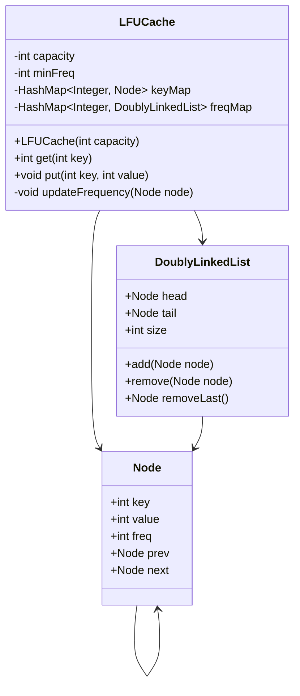

# LFU Cache

> System & Software Design Quest — Level 2

[](https://www.java.com/)
[](https://leetcode.com/problems/lfu-cache/)
[-1F883D?style=flat-square)](#complexity)
[-0969DA?style=flat-square)](#complexity)

An O(1)-average LFU cache implementation using HashMaps and
frequency-based doubly linked lists.

---

## 1. Problem

Design a cache supporting:

```java
LFUCache(int capacity)
int get(int key)
void put(int key, int value)
```

When the cache is full, eviction follows two rules:

1. Evict the **least frequently used** key.
2. If frequencies are equal, evict the **least recently used** key.

### Requirement

```text
get()  → O(1) average
put()  → O(1) average
```

---

## 2. Design

The challenge is maintaining both **frequency** and **recency** without
scanning the cache.

The solution combines four components:

```text
keyMap
key → Node
       │
       ▼
    Node
(key, value, freq)
       │
       ▼
freqMap
freq → DoublyLinkedList
       │
       ▼
MRU → ... → LRU

minFreq
minimum frequency currently present
```

| Component | Responsibility |
|---|---|
| `keyMap` | O(1) key lookup |
| `freqMap` | O(1) frequency-group lookup |
| `DoublyLinkedList` | O(1) insertion/removal and LRU ordering |
| `minFreq` | O(1) LFU identification |

This design follows the core structure of the LFU solution in this quest. :contentReference[oaicite:1]{index=1}

---

## 3. Data Model

Each cache entry is represented by:

```java
class Node {
    int key;
    int value;
    int freq;
    Node prev;
    Node next;
}
```

Each frequency owns a separate doubly linked list:

```text
Frequency 1
HEAD → A → B → C → TAIL
       MRU       LRU

Frequency 2
HEAD → D → E → TAIL
       MRU   LRU
```

A newly inserted node starts with:

```text
freq = 1
```

The list ordering provides the LRU tie-breaker. :contentReference[oaicite:2]{index=2}

---

## 4. Core Operations

### `get(key)`

```text
keyMap lookup
     ↓
Node found?
     ↓
Remove from current frequency list
     ↓
frequency++
     ↓
Insert into new frequency list
     ↓
Return value
```

```java
public int get(int key) {
    if (!keyMap.containsKey(key)) {
        return -1;
    }

    Node node = keyMap.get(key);
    updateFrequency(node);

    return node.value;
}
```

---

### `put(key, value)`

#### Existing key

```text
Find node
   ↓
Update value
   ↓
Increase frequency
   ↓
Move to new frequency list
```

#### New key

```text
Cache full?
   ↓
Yes → Remove LRU node from minFreq list
   ↓
Create node with freq = 1
   ↓
Insert into frequency-1 list
   ↓
minFreq = 1
```

---

## 5. Frequency Update

The critical operation is:

```java
updateFrequency(node)
```

Conceptually:

```text
Old Frequency
      ↓
Remove Node
      ↓
Update minFreq if required
      ↓
Frequency + 1
      ↓
New Frequency
      ↓
Insert at front
```

The front represents **most recently used** and the tail represents
**least recently used**. :contentReference[oaicite:3]{index=3}

---

## 6. Eviction

Suppose:

```text
minFreq = 2
```

and:

```text
Frequency 2

HEAD → A → B → C → TAIL
       MRU       LRU
```

The eviction candidate is:

```java
tail.prev
```

Therefore:

```text
Evict C
```

No traversal is required.

---

## 7. Example

Capacity:

```text
2
```

Operations:

```text
put(1, 1)
put(2, 2)
get(1)
put(3, 3)
get(2)
get(3)
put(4, 4)
```

### State progression

```text
put(1,1)

freq 1:
[1]
```

```text
put(2,2)

freq 1:
[2] → [1]
 MRU    LRU
```

```text
get(1)

freq 1:
[2]

freq 2:
[1]
```

```text
put(3,3)

LFU = 2

Evict 2

freq 1:
[3]

freq 2:
[1]
```

```text
get(3)

freq 2:
[3] → [1]
 MRU    LRU
```

```text
put(4,4)

Frequency tie:
3 → freq 2
1 → freq 2

LRU = 1

Evict 1
```

Final state:

```text
freq 1:
[4]

freq 2:
[3]
```

---

## 8. Why O(1)?

Each required operation is mapped directly to a constant-time structure:

```text
keyMap.get(key)
        ↓
      O(1)

freqMap.get(freq)
        ↓
      O(1)

remove(node)
        ↓
      O(1)

add(node)
        ↓
      O(1)

tail.prev
        ↓
      O(1)

minFreq
        ↓
      O(1)
```

Therefore:

| Operation | Complexity |
|---|---:|
| `get()` | **O(1) average** |
| `put()` | **O(1) average** |
| Node insertion | O(1) |
| Node removal | O(1) |
| LFU eviction | O(1) |
| Space | **O(capacity)** |

The constant-time behavior comes from combining direct HashMap lookup,
frequency grouping, linked-list ordering, and `minFreq`. :contentReference[oaicite:4]{index=4}

---

## 9. Design Invariant

The implementation maintains one important invariant:

> Every node belongs to exactly one frequency list, and the node's
> `freq` value matches that list.

For example:

```text
node.freq = 3
        ↓
freqMap.get(3)
```

This invariant keeps frequency transitions consistent.

---

## 10. UML



---

## 11. Java Implementation

Complete implementation:

[`LFUCache.java`](./LFUCache.java)

```java
import java.util.HashMap;

class LFUCache {

    class Node {
        int key;
        int value;
        int freq;
        Node prev;
        Node next;

        Node(int k, int v) {
            key = k;
            value = v;
            freq = 1;
        }
    }

    class DoublyLinkedList {
        Node head;
        Node tail;
        int size;

        DoublyLinkedList() {
            head = new Node(0, 0);
            tail = new Node(0, 0);

            head.next = tail;
            tail.prev = head;

            size = 0;
        }

        void add(Node node) {
            node.next = head.next;
            node.prev = head;

            head.next.prev = node;
            head.next = node;

            size++;
        }

        void remove(Node node) {
            node.prev.next = node.next;
            node.next.prev = node.prev;

            size--;
        }

        Node removeLast() {
            if (size == 0) {
                return null;
            }

            Node node = tail.prev;
            remove(node);

            return node;
        }
    }

    private int capacity;
    private int minFreq;

    private HashMap<Integer, Node> keyMap;
    private HashMap<Integer, DoublyLinkedList> freqMap;

    public LFUCache(int capacity) {
        this.capacity = capacity;
        this.minFreq = 0;

        keyMap = new HashMap<>();
        freqMap = new HashMap<>();
    }

    public int get(int key) {
        if (!keyMap.containsKey(key)) {
            return -1;
        }

        Node node = keyMap.get(key);

        updateFrequency(node);

        return node.value;
    }

    public void put(int key, int value) {

        if (capacity == 0) {
            return;
        }

        if (keyMap.containsKey(key)) {

            Node node = keyMap.get(key);

            node.value = value;

            updateFrequency(node);

            return;
        }

        if (keyMap.size() == capacity) {

            DoublyLinkedList list = freqMap.get(minFreq);

            Node lru = list.removeLast();

            keyMap.remove(lru.key);
        }

        Node node = new Node(key, value);

        keyMap.put(key, node);

        DoublyLinkedList list =
                freqMap.getOrDefault(
                        1,
                        new DoublyLinkedList()
                );

        list.add(node);

        freqMap.put(1, list);

        minFreq = 1;
    }

    private void updateFrequency(Node node) {

        int freq = node.freq;

        DoublyLinkedList list = freqMap.get(freq);

        list.remove(node);

        if (freq == minFreq && list.size == 0) {
            minFreq++;
        }

        node.freq++;

        DoublyLinkedList newList =
                freqMap.getOrDefault(
                        node.freq,
                        new DoublyLinkedList()
                );

        newList.add(node);

        freqMap.put(node.freq, newList);
    }
}
```

---

## 12. LRU vs LFU

| | LRU | LFU |
|---|---|---|
| Eviction | Recency | Frequency |
| Tie breaker | — | Recency |
| Frequency tracking | No | Yes |
| Main structure | HashMap + DLL | HashMap + Frequency Map + DLL |
| `get()` | O(1) | O(1) |
| `put()` | O(1) | O(1) |
| Design complexity | Medium | High |

LFU extends the LRU concept by introducing frequency-based grouping and
recency ordering within each group. :contentReference[oaicite:5]{index=5}

---

## 13. Engineering Considerations

The solution is optimized for the problem's algorithmic requirements.

A production cache would additionally consider:

```text
Thread safety
TTL / expiration
Memory limits
Monitoring
Cache invalidation
Replication
Sharding
Failure handling
```

These concerns become important when moving from an in-memory interview
implementation to a distributed caching system. :contentReference[oaicite:6]{index=6}

---

## 14. Interview Checklist

Before considering this problem complete, be able to explain:

- Why is a single HashMap insufficient?
- Why do we need a frequency map?
- Why a doubly linked list?
- Why is `tail.prev` the LRU node?
- Why is `minFreq` necessary?
- What happens when a frequency list becomes empty?
- Why does a new node start at frequency `1`?
- How is the LRU tie-breaker implemented?
- How does the design guarantee O(1) average operations?
- How would this design change for a concurrent or distributed cache?

---

## 15. Key Takeaway

The important lesson is the **data-structure composition**:

```text
HashMap
   ↓
O(1) key lookup

Frequency Map
   ↓
O(1) frequency lookup

Doubly Linked List
   ↓
O(1) recency management

minFreq
   ↓
O(1) LFU identification
```

This transforms a seemingly expensive eviction problem into an
**O(1)-average cache design**.

---

## Repository Navigation

| Previous | Current | Next |
|---|---|---|
| [01 — LRU Cache](../01-lru-cache/) | **02 — LFU Cache** | 03 — Coming Soon |

---

## References

- [LeetCode — LFU Cache](https://leetcode.com/problems/lfu-cache/)
- [System & Software Design Quest](https://leetcode.com/quest/system-and-software-design-quest/)

---

<div align="center">

**Software Design Engineering Playbook**

`Understand → Design → Implement → Analyze`

</div>
