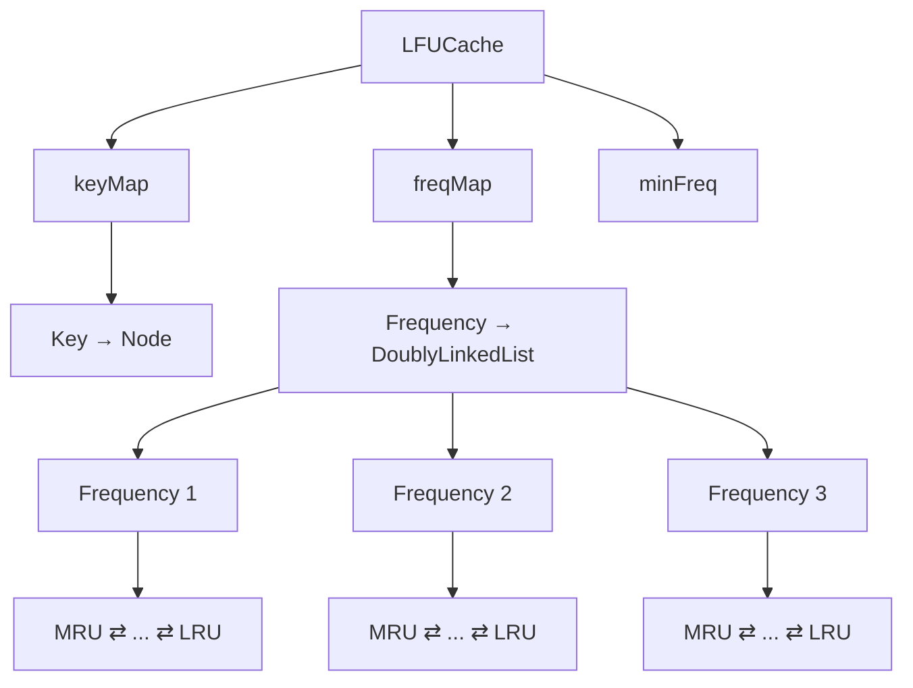
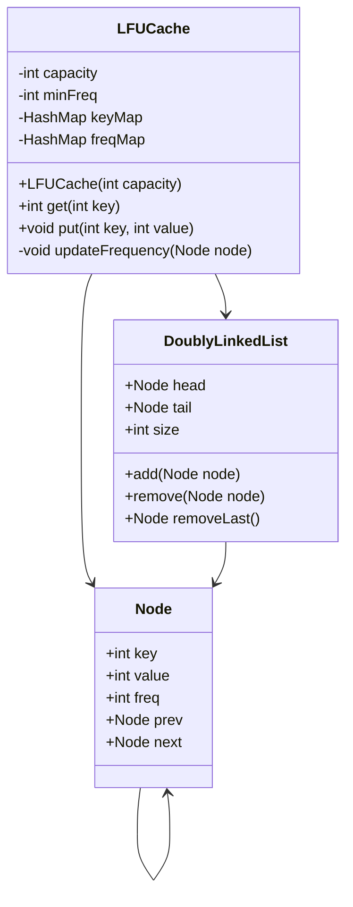

# 02 — LFU Cache

<div align="center">

### Least Frequently Used Cache

**System & Software Design Quest — Level 2**


-success?style=flat-square)


</div>

---

## 📚 Chapter Overview

This chapter designs an **LFU (Least Frequently Used) Cache** from first principles.

The objective is not simply to produce working code.

The objective is to understand:

```text
Problem
   ↓
Requirements
   ↓
Performance Constraints
   ↓
Data Structure Selection
   ↓
Design
   ↓
Algorithm
   ↓
Implementation
   ↓
Complexity
   ↓
Production Considerations
```

The final implementation combines:

```text
HashMap
    +
Frequency Map
    +
Doubly Linked Lists
    +
Minimum Frequency Tracking
```

to achieve:

```text
get()  → O(1) average
put()  → O(1) average
```

---

# 1. Problem Statement

Design and implement a data structure for a **Least Frequently Used (LFU) Cache**.

The cache supports:

```java
LFUCache(int capacity);

int get(int key);

void put(int key, int value);
```

The eviction policy is:

### Rule 1 — Frequency

Evict the key with the **lowest usage frequency**.

### Rule 2 — Recency

If multiple keys have the same frequency, evict the **least recently used** key.

Both:

```text
get()
put()
```

must run in:

```text
O(1) average time
```

---

# 2. Requirements

## 2.1 Constructor

```java
LFUCache(int capacity)
```

Creates a cache with the specified capacity.

---

## 2.2 `get(key)`

If the key exists:

```text
return value
```

and increase its frequency.

If the key does not exist:

```text
return -1
```

An accessed key also becomes the **most recently used key inside its new frequency group**.

---

## 2.3 `put(key, value)`

If the key already exists:

```text
update value
increase frequency
update recency
```

If the key does not exist:

```text
create key
frequency = 1
```

If the cache is full:

```text
evict LFU
```

If there is a frequency tie:

```text
evict LRU
```

---

# 3. The Real Design Problem

At first glance, LFU sounds simple:

> "Just count how many times each key is used."

But the requirement is stronger.

We need to answer all of these questions in O(1):

```text
1. Where is key X?
2. What is X's frequency?
3. Which frequency is the minimum?
4. Which node is the LRU node in that frequency?
5. How do we move a node to another frequency?
```

This is the actual design challenge.

---

# 4. Why a Single HashMap Is Not Enough

A simple structure:

```java
HashMap<Integer, Node>
```

can answer:

```text
Where is key X?
```

in O(1).

But it cannot efficiently answer:

```text
Which key has the smallest frequency?
```

or:

```text
Which key is the LRU among the keys
having that frequency?
```

Searching all keys would take:

```text
O(n)
```

which violates the requirement.

Therefore, we need more structure.

---

# 5. The Core Idea

We divide the problem into independent responsibilities.

```text
┌─────────────────────────────────────┐
│              LFUCache               │
├─────────────────────────────────────┤
│                                     │
│ keyMap                              │
│   ↓                                 │
│ Find a key in O(1)                  │
│                                     │
│ freqMap                             │
│   ↓                                 │
│ Find a frequency group in O(1)      │
│                                     │
│ Doubly Linked List                  │
│   ↓                                 │
│ Maintain recency in O(1)            │
│                                     │
│ minFreq                             │
│   ↓                                 │
│ Find minimum frequency in O(1)      │
│                                     │
└─────────────────────────────────────┘
```

This is the central design.

---

# 6. Data Structures

We use **four important concepts**.

## 6.1 `keyMap`

```java
HashMap<Integer, Node> keyMap;
```

Mapping:

```text
key → Node
```

Example:

```text
1 → Node(1, 100, freq=2)

2 → Node(2, 200, freq=1)

3 → Node(3, 300, freq=4)
```

### Purpose

Find a key immediately.

```java
keyMap.get(key)
```

Average:

```text
O(1)
```

---

# 7. Node

Each cache entry is represented by a node.

```java
class Node {

    int key;
    int value;
    int freq;

    Node prev;
    Node next;
}
```

Think of a node as:

```text
┌─────────────────────────┐
│          Node           │
├─────────────────────────┤
│ key                     │
│ value                   │
│ frequency               │
│ previous node           │
│ next node               │
└─────────────────────────┘
```

Why do we store `key` inside the node?

Because when we evict a node, we need to remove its key from:

```java
keyMap
```

---

# 8. Frequency Map

Now we solve the second problem.

We create:

```java
HashMap<Integer, DoublyLinkedList> freqMap;
```

Mapping:

```text
frequency → linked list
```

For example:

```text
freq = 1
    ↓
[7] ⇄ [4] ⇄ [2]

freq = 2
    ↓
[8] ⇄ [5]

freq = 3
    ↓
[9]
```

Each frequency has its own list.

---

# 9. Why a Linked List Per Frequency?

Suppose:

```text
Frequency = 2

HEAD → A → B → C → TAIL
```

The ordering means:

```text
A = MRU
C = LRU
```

If we need to evict from frequency 2:

```text
remove C
```

We can immediately access:

```java
tail.prev
```

Therefore:

```text
O(1)
```

No traversal.

---

# 10. Doubly Linked List

Every frequency group uses:

```text
HEAD ⇄ Node ⇄ Node ⇄ Node ⇄ TAIL
```

The ordering is:

```text
HEAD
  ↓
MRU
  ↓
...
  ↓
LRU
  ↓
TAIL
```

Therefore:

```java
head.next
```

is the MRU node.

And:

```java
tail.prev
```

is the LRU node.

---

# 11. Why Doubly Linked List?

Consider:

```text
A ⇄ B ⇄ C
```

If we need to remove `B`, we already know:

```text
B.prev = A
B.next = C
```

So we can directly connect:

```text
A.next = C
C.prev = A
```

No traversal is required.

Therefore:

```text
remove(node) = O(1)
```

A singly linked list would not provide the previous node directly.

---

# 12. Dummy Head and Tail

Instead of handling special cases:

```text
empty list
one node
first node
last node
```

we use dummy nodes.

```text
HEAD ⇄ A ⇄ B ⇄ C ⇄ TAIL
```

The dummy nodes are not real cache entries.

They simply simplify pointer manipulation.

---

# 13. Minimum Frequency

We maintain:

```java
private int minFreq;
```

Example:

```text
freq 1 → [A, B]
freq 2 → [C]
freq 4 → [D]

minFreq = 1
```

When eviction is required:

```java
freqMap.get(minFreq)
```

immediately gives us the LFU frequency group.

Therefore:

```text
No frequency scanning.
```

---

# 14. Complete Architecture



---

# 15. Important Invariant

The entire implementation depends on maintaining this invariant:

> **Every node exists in exactly one frequency list, and its `freq` field matches that list's frequency.**

For example:

```text
Node A:

freq = 3
```

must exist inside:

```text
freqMap.get(3)
```

and not:

```text
freqMap.get(1)
freqMap.get(2)
```

This invariant makes the system predictable.

---

# 16. `get()` Theory

Suppose:

```java
get(5)
```

We perform:

```text
Step 1
   ↓
Find key in keyMap

Step 2
   ↓
Retrieve Node

Step 3
   ↓
Remove from current frequency list

Step 4
   ↓
Increase frequency

Step 5
   ↓
Insert into new frequency list

Step 6
   ↓
Return value
```

---

# 17. `get()` Implementation

```java
public int get(int key) {

    if (!keyMap.containsKey(key)) {
        return -1;
    }

    Node node = keyMap.get(key);

    updateFrequency(node);

    return node.value;
}
```

### Mapping theory → code

```text
Does key exist?
       ↓
keyMap.containsKey(key)

Find node
       ↓
keyMap.get(key)

Update frequency
       ↓
updateFrequency(node)

Return data
       ↓
node.value
```

The entire operation remains:

```text
O(1) average
```

---

# 18. `put()` Has Two Cases

Every `put()` operation belongs to one of two categories.

```text
                 put(key,value)
                       │
              ┌────────┴────────┐
              │                 │
           Exists            New Key
              │                 │
         Update value       Check capacity
              │                 │
        Increase freq       Evict if full
              │                 │
        Update recency      Create Node
                                │
                           freq = 1
                                │
                         Insert into list
```

---

# 19. Existing Key

Suppose:

```java
put(5, 100);
```

and key `5` already exists.

We:

```text
1. Find node
2. Update value
3. Increase frequency
4. Move node to new frequency group
```

Code:

```java
if (keyMap.containsKey(key)) {

    Node node = keyMap.get(key);

    node.value = value;

    updateFrequency(node);
}
```

---

# 20. New Key

If the key does not exist:

```text
Create Node
frequency = 1
```

Why frequency 1?

Because the insertion itself counts as the first use according to the problem definition.

Then:

```text
keyMap
   ↓
key → Node

freqMap
   ↓
1 → Node
```

And:

```java
minFreq = 1;
```

---

# 21. Eviction

Suppose:

```text
capacity = 3
```

and:

```text
freq 1 → [A, B]
freq 2 → [C]
freq 4 → [D]
```

The cache is full.

We first check:

```java
minFreq
```

which is:

```text
1
```

Then:

```java
freqMap.get(1)
```

gives:

```text
[A, B]
```

Since:

```text
A = MRU
B = LRU
```

we remove:

```text
B
```

using:

```java
list.removeLast();
```

---

# 22. Why `minFreq` Matters

Without:

```java
minFreq
```

we might need to perform:

```text
1
2
3
4
5
...
n
```

frequency searches.

That would potentially become:

```text
O(n)
```

Instead:

```java
freqMap.get(minFreq)
```

gives the required frequency group immediately.

---

# 23. Frequency Update

This is the most important method in the implementation:

```java
private void updateFrequency(Node node)
```

The process is:

```text
Current frequency
       ↓
Remove from old list
       ↓
Check minFreq
       ↓
Increase frequency
       ↓
Get new frequency list
       ↓
Insert at front
```

---

# 24. Step 1 — Read Frequency

```java
int freq = node.freq;
```

Suppose:

```text
node.freq = 2
```

We remember:

```text
old frequency = 2
```

---

# 25. Step 2 — Find Old Frequency List

```java
DoublyLinkedList list = freqMap.get(freq);
```

This gives:

```text
freqMap
   ↓
frequency 2
   ↓
[Node A] ⇄ [Node B]
```

---

# 26. Step 3 — Remove Node

```java
list.remove(node);
```

The node leaves its old frequency group.

Because we have:

```text
prev
next
```

the removal is:

```text
O(1)
```

---

# 27. Step 4 — Update `minFreq`

```java
if (freq == minFreq && list.size == 0) {
    minFreq++;
}
```

This condition is important.

Suppose:

```text
minFreq = 2
```

and frequency 2 becomes empty.

Then frequency 2 no longer exists.

Therefore:

```text
minFreq = 3
```

---

# 28. Step 5 — Increase Frequency

```java
node.freq++;
```

For example:

```text
2 → 3
```

The node now belongs to:

```text
frequency 3
```

---

# 29. Step 6 — Find New Frequency List

```java
DoublyLinkedList newList =
        freqMap.getOrDefault(
                node.freq,
                new DoublyLinkedList()
        );
```

If frequency 3 already exists:

```text
use it
```

Otherwise:

```text
create it
```

---

# 30. Step 7 — Insert at Front

```java
newList.add(node);
```

Why the front?

Because the node was just accessed.

Therefore:

```text
Most Recently Used
```

inside its new frequency group.

---

# 31. Complete Frequency Update

```java
private void updateFrequency(Node node) {

    int freq = node.freq;

    DoublyLinkedList list = freqMap.get(freq);

    list.remove(node);

    if (freq == minFreq && list.size == 0) {
        minFreq++;
    }

    node.freq++;

    DoublyLinkedList newList =
            freqMap.getOrDefault(
                    node.freq,
                    new DoublyLinkedList()
            );

    newList.add(node);

    freqMap.put(node.freq, newList);
}
```

The important mental model is:

```text
Old Group
    ↓
Remove
    ↓
Frequency + 1
    ↓
New Group
    ↓
Insert at Front
```

---

# 32. Complete Example

Capacity:

```text
2
```

Operations:

```text
put(1,1)
put(2,2)
get(1)
put(3,3)
get(2)
get(3)
put(4,4)
```

---

## Operation 1

```java
put(1,1)
```

State:

```text
freq 1

HEAD → [1] → TAIL
```

```text
minFreq = 1
```

---

## Operation 2

```java
put(2,2)
```

State:

```text
freq 1

HEAD → [2] → [1] → TAIL
          MRU      LRU
```

Both have:

```text
freq = 1
```

---

## Operation 3

```java
get(1)
```

Before:

```text
freq 1:

[2] → [1]
```

After:

```text
freq 1:

[2]

freq 2:

[1]
```

Now:

```text
freq(1) = 2
freq(2) = 1
```

Therefore:

```text
minFreq = 1
```

---

## Operation 4

```java
put(3,3)
```

Cache is full.

Minimum frequency:

```text
1
```

Frequency-1 list:

```text
[2]
```

Therefore:

```text
Evict 2
```

Then:

```text
freq 1:

[3]

freq 2:

[1]
```

---

## Operation 5

```java
get(3)
```

Node `3` moves:

```text
freq 1 → freq 2
```

Now:

```text
freq 2:

[3] → [1]
 MRU     LRU
```

Both have:

```text
frequency = 2
```

---

## Operation 6

```java
put(4,4)
```

Cache is full.

Both:

```text
3 → frequency 2
1 → frequency 2
```

Tie.

So use LRU.

```text
[3] → [1]
 MRU     LRU
```

Evict:

```text
1
```

Final:

```text
freq 1:

[4]

freq 2:

[3]
```

---

# 33. Full Data Structure State

At any point, the cache can conceptually look like:

```text
                  LFUCache
                     │
       ┌─────────────┼─────────────┐
       │             │             │
       ▼             ▼             ▼
    keyMap        freqMap       minFreq
       │             │             │
       │             │             └── 1
       │             │
       │       ┌─────┴─────┐
       │       │           │
       ▼       ▼           ▼
      Node    freq=1      freq=2
       │        │           │
       │        ▼           ▼
       │      DLL          DLL
       │        │           │
       │     A ⇄ B        C ⇄ D
       │
       └── key → Node
```

---

# 34. UML



---

# 35. Algorithm Summary

## `get(key)`

```text
                    get(key)
                       │
                       ▼
                keyMap lookup
                       │
                ┌──────┴──────┐
                │             │
              Missing       Found
                │             │
                ▼             ▼
              -1        updateFrequency
                              │
                              ▼
                       return value
```

---

## `put(key,value)`

```text
                  put(key,value)
                        │
                        ▼
                 Does key exist?
                  /           \
                Yes            No
                 │              │
                 ▼              ▼
            Update value    Is cache full?
                 │           /       \
                 │         Yes        No
                 │          │          │
                 │          ▼          │
                 │       Evict LFU     │
                 │          │          │
                 └──────────┴──────────┘
                            │
                            ▼
                      Create/Update
                            │
                            ▼
                       Frequency = 1
                         for new key
                            │
                            ▼
                      Update minFreq
```

---

# 36. Complexity

| Operation | Complexity |
|---|---:|
| Key lookup | O(1) average |
| Frequency lookup | O(1) average |
| Node insertion | O(1) |
| Node removal | O(1) |
| Frequency update | O(1) |
| LFU eviction | O(1) |
| `get()` | **O(1) average** |
| `put()` | **O(1) average** |
| Space | **O(capacity)** |

The implementation achieves the required average-case O(1) operations through the combined data-structure design. :contentReference[oaicite:1]{index=1}

---

# 37. Why the Design Works

The entire solution can be remembered using this formula:

```text
                    LFU CACHE

             ┌────────────────────┐
             │      HashMap        │
             │    key → Node       │
             └─────────┬──────────┘
                       │
                       ▼
             ┌────────────────────┐
             │     freqMap        │
             │ freq → LinkedList  │
             └─────────┬──────────┘
                       │
                       ▼
             ┌────────────────────┐
             │ Doubly Linked List │
             │   MRU → ... → LRU  │
             └─────────┬──────────┘
                       │
                       ▼
                 minFreq
```

So:

```text
HashMap
    → Find key

freqMap
    → Find frequency

Doubly Linked List
    → Maintain recency

minFreq
    → Find LFU group
```

---

# 38. LRU vs LFU

| Property | LRU | LFU |
|---|---|---|
| Eviction | Least recently used | Least frequently used |
| Frequency tracking | No | Yes |
| Recency tracking | Yes | Yes |
| Tie-breaking | N/A | LRU |
| Main structures | HashMap + DLL | HashMap + frequency map + DLL |
| `get()` | O(1) average | O(1) average |
| `put()` | O(1) average | O(1) average |
| Design complexity | Medium | High |

The LFU design therefore extends the LRU idea by adding **frequency-based grouping and frequency transitions**. :contentReference[oaicite:2]{index=2}

---

# 39. Common Mistakes

### Mistake 1 — Scanning all keys

```text
Find minimum frequency by looping
```

This violates O(1).

### Mistake 2 — Searching the linked list

Never traverse the list to find the LRU node.

Use:

```java
tail.prev
```

### Mistake 3 — Forgetting to update frequency

Both:

```text
get()
put(existing key)
```

increase the frequency.

### Mistake 4 — Forgetting the LRU tie-breaker

LFU alone is not enough.

The rule is:

```text
Lowest frequency
        ↓
If tie
        ↓
Least recently used
```

### Mistake 5 — Forgetting `minFreq`

Without `minFreq`, identifying the LFU group may require a scan.

---

# 40. Production Engineering

This implementation solves the algorithmic problem.

A real production cache would need additional concerns.

## Thread Safety

Multiple threads may call:

```text
get()
put()
```

simultaneously.

Possible solutions:

```text
synchronized blocks
ReentrantLock
Read/Write Locks
Concurrent data structures
```

---

## Memory Management

Production caches need limits such as:

```text
Maximum entries
Maximum memory
TTL
Eviction policy
```

---

## Distributed Cache

A distributed caching architecture could look like:

```text
Client
   │
   ▼
Load Balancer
   │
   ├────────────┬────────────┐
   ▼            ▼            ▼
Server A     Server B     Server C
   │            │            │
   └────────────┼────────────┘
                ▼
        Distributed Cache
                │
                ▼
             Database
```

Production concerns include:

```text
Sharding
Replication
Consistency
Cache invalidation
Failover
Hot keys
Network latency
Monitoring
```

The uploaded design notes similarly identify thread safety, memory limits, TTL, distribution, partitioning, replication, consistency and cache invalidation as production concerns beyond the basic LeetCode implementation. :contentReference[oaicite:3]{index=3}

---

# 41. Interview Questions

### Q1. Why do we need two HashMaps?

Because they solve two different problems:

```text
keyMap
→ key lookup

freqMap
→ frequency-group lookup
```

---

### Q2. Why use a Doubly Linked List?

To remove and insert arbitrary nodes in O(1).

---

### Q3. Why maintain `minFreq`?

To identify the minimum frequency without scanning.

---

### Q4. Why is `tail.prev` the LRU node?

Because the list maintains:

```text
HEAD → MRU → ... → LRU → TAIL
```

---

### Q5. What happens when frequency 1 becomes empty?

If:

```java
freq == minFreq
```

and the list becomes empty:

```java
minFreq++;
```

---

### Q6. Why does a new node have frequency 1?

Because the insertion operation counts as the first use under the problem's rules.

---

### Q7. What happens when an existing key is updated?

Its value changes and its usage frequency increases.

---

### Q8. What happens when two keys have equal frequency?

The LRU key within that frequency group is removed.

---

### Q9. Can LFU be implemented with a priority queue?

Yes, conceptually, but maintaining exact frequency and recency while guaranteeing O(1) average `get()` and `put()` is the challenge. The HashMap + frequency lists design directly satisfies the required complexity.

---

### Q10. How would you make this production-ready?

Consider:

```text
Thread safety
TTL
Memory limits
Metrics
Distributed caching
Replication
Sharding
Failure handling
Cache invalidation
```

---

# 42. Java Implementation

The complete implementation is available in:

```text
LFUCache.java
```

The implementation uses:

```java
HashMap<Integer, Node>
```

for direct key lookup,

```java
HashMap<Integer, DoublyLinkedList>
```

for frequency grouping,

```java
DoublyLinkedList
```

for recency management,

and:

```java
minFreq
```

for constant-time LFU identification.

---

# 43. Test Case

### Input

```text
["LFUCache","put","put","get","put","get","get",
 "put","get","get","get"]
```

### Operations

```text
capacity = 2

put(1,1)
put(2,2)
get(1)
put(3,3)
get(2)
get(3)
put(4,4)
get(1)
get(3)
get(4)
```

### Output

```text
[null,null,null,1,null,-1,3,null,-1,3,4]
```

---

# 44. Key Takeaways

The most important lesson is not the Java syntax.

It is the design.

```text
Requirement:
O(1) get + O(1) put

        ↓

HashMap
O(1) key lookup

        +

Frequency Map
O(1) frequency lookup

        +

Doubly Linked List
O(1) insertion/removal

        +

minFreq
O(1) LFU identification

        ↓

Complete LFU Cache
```

> **Good system design comes from choosing data structures according to the operations the system must perform efficiently.**

---

# 🔗 References

- [LeetCode — LFU Cache](https://leetcode.com/problems/lfu-cache/)
- [LeetCode — System & Software Design Quest](https://leetcode.com/quest/system-and-software-design-quest/)

---

# 🔙 Navigation

| Previous | Current | Next |
|---|---|---|
| [01 — LRU Cache](../01-lru-cache/) | **02 — LFU Cache** | [03 — Coming Soon](../03-...) |

---

<div align="center">

### 🚀 Software Design Engineering Playbook

**Understand → Design → Implement → Analyze → Scale**

⭐ **Star the repository if you find it useful.**

</div>
