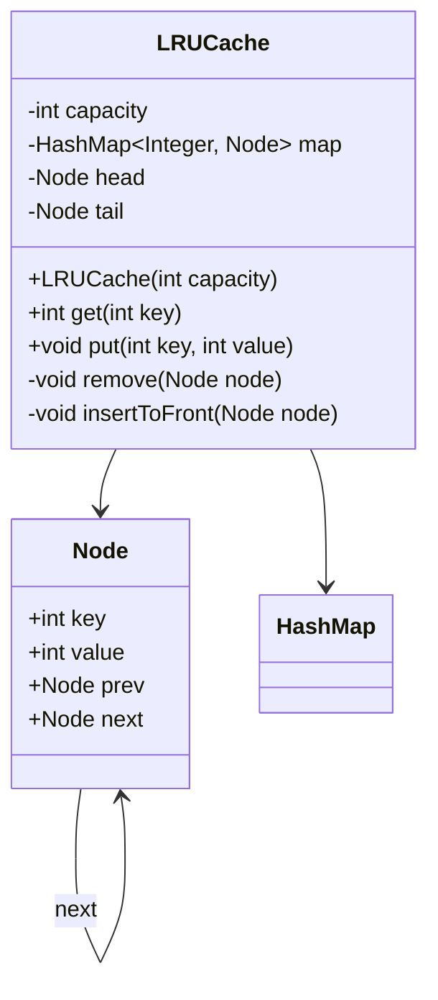
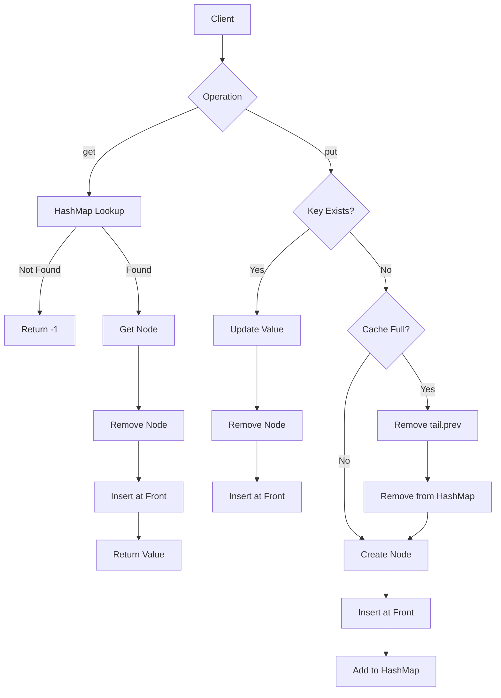

# 01 — LRU Cache

> **System & Software Design Quest — Level 1**

A production-oriented implementation of a **Least Recently Used (LRU) Cache** using a **HashMap + Doubly Linked List** to achieve **O(1) average time complexity** for both `get()` and `put()` operations.

---

## 📌 Problem Statement

Design a data structure that follows the constraints of a **Least Recently Used (LRU) Cache**.

The cache must support:

- Retrieving a value by key.
- Inserting or updating a key-value pair.
- Automatically evicting the **least recently used** entry when capacity is exceeded.

Both operations must run in:

```text
O(1) average time complexity
```

---

## 🎯 Requirements

### Functional Requirements

The cache should provide:

```java
LRUCache(int capacity)
int get(int key)
void put(int key, int value)
```

### `get(key)`

- Return the value if the key exists.
- Return `-1` if the key does not exist.
- Accessing an existing key makes it the **most recently used** entry.

### `put(key, value)`

- Insert a new key-value pair.
- Update the value if the key already exists.
- Updated/accessed entries become the **most recently used**.
- If capacity is exceeded, remove the **least recently used** entry.

---

# 🧠 Design Approach

The key challenge is achieving:

```text
get() → O(1)
put() → O(1)
```

A single data structure is not sufficient.

Therefore, the implementation combines two data structures:

### 1. HashMap

Used for:

```text
Key → Node
```

The HashMap provides:

```text
O(1) average lookup
```

### 2. Doubly Linked List

Used to maintain the order of usage.

```text
Most Recently Used
        ↓
   [Node] ⇄ [Node] ⇄ [Node]
                            ↓
                    Least Recently Used
```

The combination gives us both:

- Fast lookup
- Fast insertion/removal
- Fast identification of the LRU entry

---

# 🏗️ Architecture

```text
                    LRUCache
                       │
             ┌─────────┴─────────┐
             │                   │
          HashMap           Doubly Linked List
             │                   │
        key → Node          Usage Ordering
             │                   │
             └─────────┬─────────┘
                       │
                    Node
              ┌────────┴────────┐
              │                 │
             key              value
              │                 │
            prev              next
```

---

# 🔗 Data Structure Design

Each cache entry is represented by a `Node`.

```java
class Node {
    int key;
    int value;
    Node prev;
    Node next;
}
```

The node stores:

- `key` — required for removing the node from the HashMap.
- `value` — cached data.
- `prev` — previous node.
- `next` — next node.

---

# 📍 List Ordering

The linked list maintains the cache according to **recent usage**.

```text
HEAD
 ↓
[Most Recently Used]
 ↓
[Recently Used]
 ↓
[Less Recently Used]
 ↓
[Least Recently Used]
 ↓
TAIL
```

Therefore:

```text
head.next
```

represents the **MRU entry**.

And:

```text
tail.prev
```

represents the **LRU entry**.

---

# 🧩 Dummy Head & Tail Nodes

The implementation uses two dummy nodes:

```text
HEAD ⇄ Node ⇄ Node ⇄ Node ⇄ TAIL
```

They do not represent actual cache entries.

Their purpose is to simplify insertion and removal.

Without dummy nodes, we would repeatedly need to handle special cases such as:

- Removing the first node.
- Removing the last node.
- Adding to an empty list.
- Updating head/tail references.

With dummy nodes, the operations become uniform.

Initialization:

```java
head.next = tail;
tail.prev = head;
```

---

# 🔄 Core Operations

## 1. `get(key)`

### Process

```text
        HashMap
           │
           ▼
      Find Node
           │
     ┌─────┴─────┐
     │           │
   Found       Not Found
     │           │
     ▼           ▼
 Remove       return -1
 Node
     │
     ▼
Move to Front
     │
     ▼
Return value
```

### Why move the node?

Because accessing an entry makes it **recently used**.

Example:

```text
Before:

HEAD → 1 → 2 → 3 → TAIL
        ↑
       MRU

Access key 2

After:

HEAD → 2 → 1 → 3 → TAIL
        ↑
       MRU
```

---

# 2. `put(key, value)`

There are two cases.

### Case 1 — Key already exists

```text
Find Node
   ↓
Update value
   ↓
Remove from current position
   ↓
Move to front
```

Example:

```text
Before:

HEAD → 1 → 2 → 3 → TAIL

put(2, 20)

After:

HEAD → 2 → 1 → 3 → TAIL
```

---

### Case 2 — Key does not exist

Create a new node:

```text
Node(key, value)
```

Insert it at the front.

If the cache is already full:

```text
Remove tail.prev
```

because `tail.prev` is the least recently used node.

---

# 🔥 Example Walkthrough

Capacity:

```text
2
```

### Operation 1

```text
put(1, 1)
```

Cache:

```text
HEAD → [1] → TAIL
```

---

### Operation 2

```text
put(2, 2)
```

Cache:

```text
HEAD → [2] → [1] → TAIL
```

`2` is the most recently used.

`1` is the least recently used.

---

### Operation 3

```text
get(1)
```

Return:

```text
1
```

Since `1` was accessed:

```text
HEAD → [1] → [2] → TAIL
```

---

### Operation 4

```text
put(3, 3)
```

Capacity is already full.

The LRU entry is:

```text
2
```

Therefore:

```text
HEAD → [3] → [1] → TAIL
```

---

### Operation 5

```text
get(2)
```

Key `2` was evicted.

Therefore:

```text
-1
```

---

# 🧮 Complexity Analysis

| Operation | Time | Space |
|---|---:|---:|
| `get()` | O(1) average | O(1) |
| `put()` | O(1) average | O(1) |
| Remove Node | O(1) | O(1) |
| Insert Node | O(1) | O(1) |
| Overall Cache | — | O(capacity) |

### Why is `get()` O(1)?

The HashMap directly gives us the node:

```java
Node node = map.get(key);
```

No traversal is required.

### Why is removal O(1)?

Because every node maintains:

```text
prev
next
```

Therefore, its neighbors can be updated directly.

### Why is eviction O(1)?

The least recently used node is always:

```java
tail.prev
```

No traversal is required.

---

# 💻 Java Implementation

```java
import java.util.HashMap;

class LRUCache {

    class Node {
        int key, value;
        Node prev, next;

        Node(int k, int v) {
            key = k;
            value = v;
        }
    }

    private int capacity;
    private HashMap<Integer, Node> map;
    private Node head, tail;

    public LRUCache(int capacity) {
        this.capacity = capacity;
        map = new HashMap<>();

        // Dummy nodes
        head = new Node(0, 0);
        tail = new Node(0, 0);

        head.next = tail;
        tail.prev = head;
    }

    public int get(int key) {

        if (!map.containsKey(key))
            return -1;

        Node node = map.get(key);

        remove(node);
        insertToFront(node);

        return node.value;
    }

    public void put(int key, int value) {

        if (map.containsKey(key)) {

            Node node = map.get(key);

            node.value = value;

            remove(node);
            insertToFront(node);

        } else {

            if (map.size() == capacity) {

                Node lru = tail.prev;

                remove(lru);
                map.remove(lru.key);
            }

            Node newNode = new Node(key, value);

            insertToFront(newNode);
            map.put(key, newNode);
        }
    }

    private void remove(Node node) {

        node.prev.next = node.next;
        node.next.prev = node.prev;
    }

    private void insertToFront(Node node) {

        node.next = head.next;
        node.prev = head;

        head.next.prev = node;
        head.next = node;
    }
}
```

---

# 🧱 Design Principles

This implementation demonstrates several important software design principles.

### Encapsulation

Internal cache management is hidden behind:

```java
get()
put()
remove()
insertToFront()
```

The caller does not need to know how the cache is implemented.

---

### Separation of Responsibilities

The responsibilities are divided between:

```text
HashMap
    ↓
Fast lookup

Doubly Linked List
    ↓
Usage ordering
```

Each structure has a clearly defined purpose.

---

### Abstraction

The client only interacts with:

```java
get(key)
put(key, value)
```

Implementation details remain internal.

---

# 🎨 UML Class Diagram



---

# 🔄 Operation Flow



---

# 🧠 Important Design Insight

The most important idea behind this implementation is:

> **HashMap provides O(1) access, while the Doubly Linked List provides O(1) ordering and eviction.**

Neither structure alone is sufficient.

### HashMap alone

Would provide:

```text
O(1) lookup
```

but determining the least recently used key would be difficult.

### Linked List alone

Would maintain ordering but searching for a key would require:

```text
O(n)
```

### Combined Design

```text
HashMap
   +
Doubly Linked List
   =
O(1) average get()
O(1) average put()
```

---

# 🌍 Real-World Applications

LRU caching is widely applicable to systems where recently accessed data should remain available for fast retrieval.

Examples include:

- Database query caching
- Web application caching
- API response caching
- Operating system page caching
- CPU/cache hierarchy concepts
- CDN caching
- Session caching
- Distributed caching systems
- In-memory data stores

A production distributed cache may use technologies such as Redis or Memcached, while the underlying eviction concept can still be based on policies such as LRU.

---

# 🚀 Production Considerations

The LeetCode implementation is intentionally minimal.

A production-grade cache would additionally need to consider:

### Thread Safety

Concurrent access may require:

```text
Locks
Concurrent data structures
Read/write synchronization
```

### Memory Management

Large caches require:

```text
Memory limits
Eviction policies
Monitoring
```

### Distributed Systems

For distributed caching:

```text
Client
   ↓
Load Balancer
   ↓
Application Servers
   ↓
Distributed Cache
   ↓
Database
```

Additional concerns include:

- Cache consistency
- Cache invalidation
- Replication
- Partitioning
- Failover
- TTL
- Network latency

---

# 🎤 Interview Questions

### 1. Why use a HashMap?

To achieve O(1) average lookup.

### 2. Why use a Doubly Linked List?

Because nodes can be removed and repositioned in O(1).

### 3. Why not use an ArrayList?

Removing or moving elements can require O(n) shifting.

### 4. Why not use a singly linked list?

Removing an arbitrary node requires knowing its previous node.

### 5. Why use dummy head and tail nodes?

They eliminate edge cases when inserting or removing nodes.

### 6. Why does `get()` modify the cache?

Because accessing an entry changes its recency.

### 7. Why is `tail.prev` the LRU node?

The list maintains the most recently used node near the head and the least recently used node near the tail.

### 8. What happens when an existing key is updated?

Its value is updated and the node becomes the most recently used entry.

### 9. Can this implementation be made thread-safe?

Yes, but synchronization/concurrency mechanisms would need to be introduced.

### 10. How would you design a distributed LRU cache?

Consider:

```text
Consistent Hashing
Replication
Sharding
TTL
Cache Invalidation
Failover
Monitoring
```

---

# 📚 Key Takeaways

```text
HashMap
   ↓
Fast Key Lookup

Doubly Linked List
   ↓
Fast Ordering

Together
   ↓
O(1) Average get()
O(1) Average put()
```

The LRU Cache is a classic example of how **multiple data structures can be combined to satisfy strict performance requirements**.

---

## 🔗 Problem

[LeetCode — LRU Cache](https://leetcode.com/problems/lru-cache/)

[LeetCode — System & Software Design Quest](https://leetcode.com/quest/system-and-software-design-quest/)

---

<div align="center">

### 🚀 System & Software Design Engineering Playbook

**Design • Implement • Analyze • Scale**

⭐ Star this repository if you find it useful.

</div>
